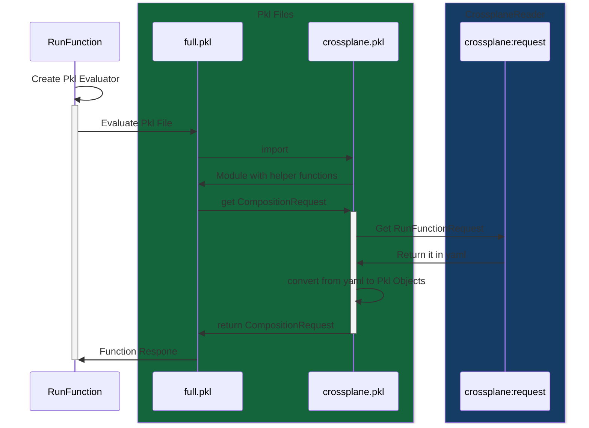

# function-pkl
[](https://github.com/crossplane-contrib/function-pkl/actions/workflows/ci.yml)

This [composition function][functions] allows to deploy [Crossplane Managed Resources][crossplane] from [Pkl Packages][pkl].

## Installation
```yaml
apiVersion: pkg.crossplane.io/v1beta1
kind: Function
metadata:
  name: function-pkl
spec:
  package: ghcr.io/crossplane-contrib/function-pkl:v0.0.1
```

## Usage
To use this function create add the following to your composition:
```yaml
apiVersion: apiextensions.crossplane.io/v1
kind: Composition
metadata:
  name: function-pkl
spec:
  compositeTypeRef:
    apiVersion: example.crossplane.io/v1
    kind: XR
  mode: Pipeline
  pipeline:
  - step: run-the-template
    functionRef:
      name: function-pkl
    input:
      apiVersion: pkl.fn.crossplane.io/v1beta1
      kind: Pkl
      spec:
        type: uri
        # This pkl file is at `pkl/crossplane.contrib.example/compositions/steps/full.pkl` in this repo
        uri: "package://pkg.pkl-lang.org/github.com/crossplane-contrib/function-pkl/crossplane.contrib.example@0.0.1#/compositions/steps/full.pkl"
```

### Example
see [examples](./example/)
and see [pkl/crossplane.contrib.example/DEPLOY.md](pkl/crossplane.contrib.example/DEPLOY.md) on instructions how to deploy it.
## Creating a new Composition Function
see [pkl/crossplane.contrib.example/DEVELOP.md](pkl/crossplane.contrib.example/DEVELOP.md)

## Development
This function uses [Go][go], [Docker][docker], the [Crossplane CLI][cli], and the [Pkl CLI][pkl cli] to build functions

```shell
# Run code generation - see input/generate.go
$ make generate

# Run tests - see fn_test.go
$ go test ./...

# Build the function's runtime image and package it - see Dockerfile and package/crossplane.yaml
$ make build-image

# Push the Package to a registry
$ crossplane xpkg push -f function-pkl*.xpkg ghcr.io/crossplane-contrib/function-pkl

# Resolve Pkl Project Dependencies
$ make pkl-resolve

# Release a Pkl Project
$ git tag crossplane.contrib@x.y.z
$ git push --tags

# Packages the Pkl Projects. Uses the latest existing git tags to version them.
$ make pkl-package

# Manually release a Pkl Package on github
$ make pkl-release TAG=crossplane.contrib@x.y.z

# Debugging this function
# While a Debugging session is running run on the same host:
$ crossplane beta render xr.yaml composition.yaml functions.yaml --verbose
```

### Creating a new Release
#### Composition Function
Run the [CI action](https://github.com/crossplane-contrib/function-pkl/actions/workflows/ci.yml) and provide a Package version.
#### Pkl Packages
Create a git tag in the style of <PklProject.package.name>@<PklProject.package.version> e.g. `git tag crossplane.contrib@0.0.1`

Push it `git push --tags`

### Pkl Function Flow
This Chart illustrates the intereactions between the function and Pkl, when Crossplane Triggers this Composition Function.



[functions]: https://docs.crossplane.io/latest/concepts/composition-functions
[go]: https://go.dev
[crossplane]: https://www.crossplane.io
[function guide]: https://docs.crossplane.io/knowledge-base/guides/write-a-composition-function-in-go
[package docs]: https://pkg.go.dev/github.com/crossplane/function-sdk-go
[docker]: https://www.docker.com
[cli]: https://docs.crossplane.io/latest/cli
[pkl]: https://pkl-lang.org
[pkl cli]: https://pkl-lang.org/main/current/pkl-cli/index.html#installation
[provider-kubernetes]: https://marketplace.upbound.io/providers/crossplane-contrib/provider-kubernetes/v0.13.0
[provider-kubernetes-object]: https://marketplace.upbound.io/providers/crossplane-contrib/provider-kubernetes/v0.13.0/resources/kubernetes.crossplane.io/Object/v1alpha2
