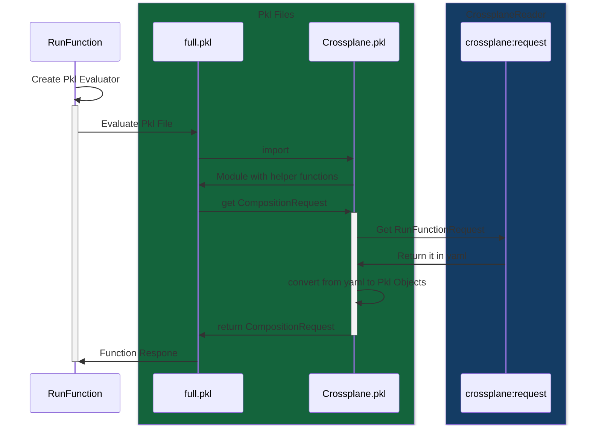

# function-pkl
[](https://github.com/crossplane-contrib/function-pkl/actions/workflows/ci.yml)

This [composition function][functions] allows to deploy [Crossplane Managed Resources][crossplane] from [Pkl Packages][pkl].

## Installation
```yaml
apiVersion: pkg.crossplane.io/v1beta1
kind: Function
metadata:
  name: function-pkl
spec:
  package: ghcr.io/crossplane-contrib/function-pkl:v0.0.1
```

## Usage
To use this function create add the following to your composition:
```yaml
apiVersion: apiextensions.crossplane.io/v1
kind: Composition
metadata:
  name: function-pkl
spec:
  compositeTypeRef:
    apiVersion: example.crossplane.io/v1
    kind: XR
  mode: Pipeline
  pipeline:
  - step: run-the-template
    functionRef:
      name: function-pkl
    input:
      apiVersion: template.fn.crossplane.io/v1beta1
      kind: Pkl
      spec:
        type: uri
        # This pkl file is at `pkl/crossplane-example/full.pkl` in this repo
        uri: "package://pkg.pkl-lang.org/github.com/crossplane-contrib/function-pkl/crossplane-example@1.0.0#/full.pkl"
```

### Example
see [examples](./example/)

### Building a new Composition Function from Scratch
Most Crossplane resources can be Converted to Pkl.
> Note: In Pkl there is a difference between CRDs which are Modules vs. amending CRD itself.
> the latter can be rendered to yaml and applied to Clusters.

- [Composite Resource Definitions](#create-a-composite-resource-definition-xrd-in-pkl) (XRD) can be created in Pkl
- Pkl XRDs can be [converted to Modules](#create-a-module-of-your-xrd)
- Yaml XRDs can also be converted to Modules
- CRDs/Managed Resources can be converted to Pkl
- Compositions themselves must be created in Yaml
- The CompositionFunction Pkl file

#### Create a Composite Resource Definition (XRD) in Pkl
Create a new Pkl file
```pkl
amends "package://pkg.pkl-lang.org/github.com/crossplane-contrib/function-pkl/crospslane.contrib.xrd@1.0.0#/CompositeResourceDefinition.pkl"
```
the Pkl file can be rendered as Yaml using `pkl eval <nameOfYourPklFile>.pkl`

#### Create a Module of your XRD (from Pkl)
To Convert the XRD.pkl to Pkl Module a small helper file `xrd2module.pkl` is needed:
```pkl
amends "package://pkg.pkl-lang.org/github.com/crossplane-contrib/function-pkl/crospslane.contrib.xrd@1.0.0#/generate.pkl"
// To convert from a Yaml file uncomment the following section
// source = "./XR.yaml"

// To convert from a Pkl file uncomment the following section
// crds {
//   import("XR.pkl")
// }

// The Package references to be used within the Module
k8sImportPath = "@k8s" // package://pkg.pkl-lang.org/pkl-k8s/k8s@1.0.1#
crossplaneImportPath = "@crossplane.contrib" // package://pkg.pkl-lang.org/github.com/crossplane-contrib/function-pkl/crossplane.contrib 
```

running `pkl eval generate.pkl -m .` will generate a new Module that can be imported and referenced in the Composition.

#### Create Managed Resources in Pkl
Import Managed Resources and Preexisting CompositeResourceDefinitions to Pkl
```bash
pkl eval "package://pkg.pkl-lang.org/pkl-pantry/k8s.contrib.crd@1.0.7#/generate.pkl" \
  -m . \
  -p source="https://raw.githubusercontent.com/crossplane-contrib/provider-kubernetes/main/package/crds/kubernetes.crossplane.io_objects.yaml"
```

#### Create the Composition Function Logic
The Function must amend CompositionResponse.pkl.

This is a very minimal example. A more extensive one can be found in `pkl/crossplane.contrib.example`
```pkl
amends "crossplane.contrib/CompositionResponse.pkl"
import "crds/Object.pkl"
import "@k8s/api/core/v1/ConfigMap.pkl"

desired {
   resources {
      ["example"] = new Resource {
         resource = new Object {
            metadata {
               name = "example"
            }
            spec {
               forProvider {
                  manifest = new ConfigMap {
                     metadata {
                        name = "example"
                        namespace = "crossplane-system"
                     }
                     data {
                        ["hello"] = "world"
                     }
                  }
               }
            }
         }
      }
   }
}
```
#### Create Composition
```yaml
apiVersion: apiextensions.crossplane.io/v1
kind: Composition
metadata:
  name: function-pkl
spec:
  compositeTypeRef:
    apiVersion: example.crossplane.io/v1
    kind: XR
  mode: Pipeline
  pipeline:
  - step: run-the-template
    functionRef:
      name: function-pkl
    input:
      apiVersion: template.fn.crossplane.io/v1beta1
      kind: Pkl
      spec:
        type: uri
        # This pkl file is at `pkl/crossplane-example/full.pkl` in this repo
        uri: "package://pkg.pkl-lang.org/github.com/crossplane-contrib/function-pkl/crossplane-example@1.0.0#/full.pkl"
```

## Building a Pkl Package
A Pkl Package can be built in the following steps:
1. Create Pkl files in a directory
    > Note: you can [convert CRDs and Manifests](#generating-pkl-files-and-modules-from-manifests) to Pkl
1. Create a PklProject file (take a look at pkl/crossplane-example/PklProject for reference)
    * Make sure that `\(baseUri)@\(version)` is the url where the package metadata can be downloaded from
    * Likewise `\(baseUri)@\(version).zip` is the path where the content will be expected.
    > Note: The PklProjects in this repository use pkg.pkl-lang.org, as they redirect to the download
        * the path https://pkg.pkl-lang.org/github.com/crossplane-contrib/function-pkl/crossplane@x.y.z
        * redirects to https://github.com/crossplane-contrib/function-pkl/releases/download/crossplane@x.y.z/crossplane@x.y.z
1. Run `pkl project resolve` to resolve the dependencies of the PklProject
1. Run `pkl project package` to package the Project into the files and make them ready for the upload.
1. Publish the Package
    * This can be done by uploading the files created by the previous command to the place defined in step 2.
    * in github this can be done by creating a release and uploading the files to it.

## Basic Pkl File
Pkl Files used in this Function **must** amend CompositionRequest.pkl.
see [here](example/inline/composition.yaml) and [here](pkl/crossplane.contrib.example/full.pkl)

### Generating Pkl Files and Modules from Manifests
There are some package to make it easier to convert existing CRDs or Manifests into the Pkl format.
> [!NOTE]
> There is currently no module to convert from CompositeResourceDefinitions (XRDs) to Pkl.
> Crossplane Creates CRDs from the XRDs. These CRDs can be converted instead.
> If direct conversion would be useful to you - please create an issue.

In this example we'll implement the [Object][provider-kubernetes-object] resource from [provider-kubernetes][provider-kubernetes].

1. First we will generate a Pkl Module from the Object CRD.
   ```bash
   pkl eval "package://pkg.pkl-lang.org/pkl-pantry/k8s.contrib.crd@1.0.4#/generate.pkl" -m . -p source="https://raw.githubusercontent.com/crossplane-contrib/provider-kubernetes/main/package/crds/kubernetes.crossplane.io_objects.yaml"
   ```
   This should create a `Object.pkl` file.

1. Create a small Pkl file which adds context for the converter about the CRDs.
   ```pkl
   amends "package://pkg.pkl-lang.org/pkl-pantry/k8s.contrib@1.0.1#/convert.pkl"
   customResourceTemplates {
     ["Object"] {
       ["kubernetes.crossplane.io/v1alpha2"] = import("Object.pkl")
     }
   }
   ```

1. Convert a object manifest to pkl
   ```bash
   pkl eval -p "input=https://raw.githubusercontent.com/crossplane-contrib/provider-kubernetes/main/examples/object/object.yaml" -o example-object.pkl <CONVERT-FILE-FROM-PREVIOUS-STEP>.pkl
   ```

## Development
This function uses [Go][go], [Docker][docker], the [Crossplane CLI][cli], and the [Pkl CLI][pkl cli] to build functions

```shell
# Run code generation - see input/generate.go
$ go generate ./...

# Run tests - see fn_test.go
$ go test ./...

# Build the function's runtime image - see Dockerfile
$ docker build . --tag=runtime

# Build a function package - see package/crossplane.yaml
$ crossplane xpkg build -f package --embed-runtime-image=runtime

# Push the Package to a registry
$ crossplane xpkg push -f function-pkl*.xpkg ghcr.io/crossplane-contrib/function-pkl

# Resolve Pkl Project Dependencies
$ pkl project resolve

# Package the Pkl Project
$ pkl project package

# Debugging this function
# While a Debugging session is running run on the same host:
$ crossplane beta render xr.yaml composition.yaml functions.yaml --verbose
```

### Pkl Function Flow
This Chart illustrates how what happens, when Crossplane Triggers this Composition Function.




[functions]: https://docs.crossplane.io/latest/concepts/composition-functions
[go]: https://go.dev
[crossplane]: https://www.crossplane.io
[function guide]: https://docs.crossplane.io/knowledge-base/guides/write-a-composition-function-in-go
[package docs]: https://pkg.go.dev/github.com/crossplane/function-sdk-go
[docker]: https://www.docker.com
[cli]: https://docs.crossplane.io/latest/cli
[pkl]: https://pkl-lang.org
[pkl cli]: https://pkl-lang.org/main/current/pkl-cli/index.html#installation
[provider-kubernetes]: https://marketplace.upbound.io/providers/crossplane-contrib/provider-kubernetes/v0.13.0
[provider-kubernetes-object]: https://marketplace.upbound.io/providers/crossplane-contrib/provider-kubernetes/v0.13.0/resources/kubernetes.crossplane.io/Object/v1alpha2
